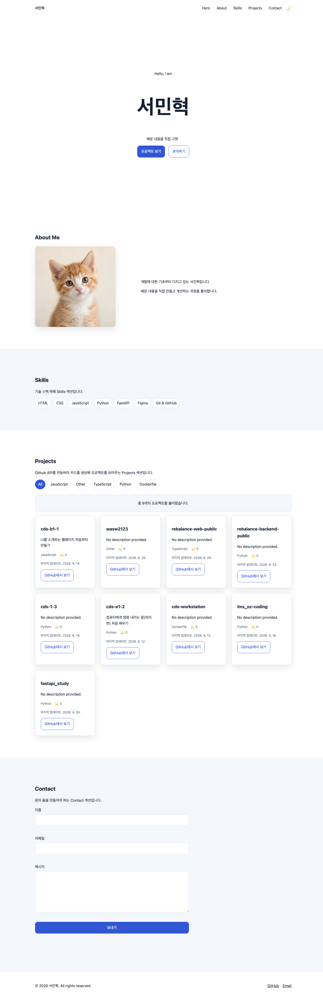
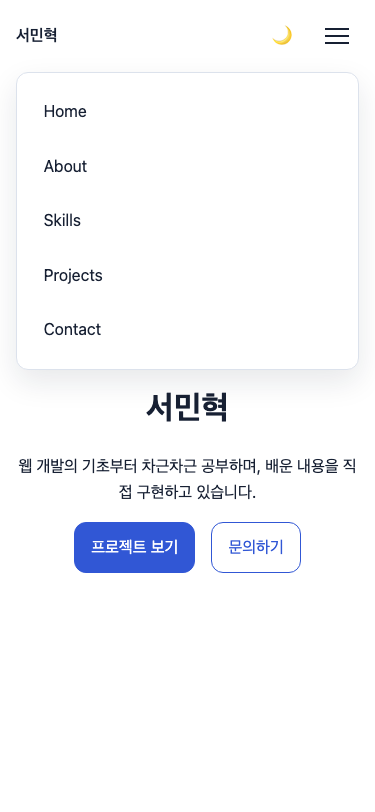
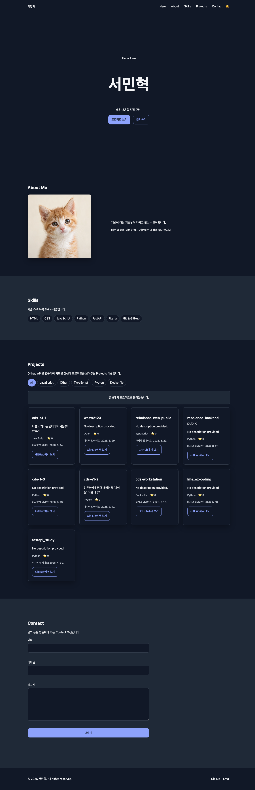

# 서민혁 Portfolio

순수 HTML, CSS, JavaScript로 만든 반응형 웹 포트폴리오입니다. 웹 개발의 기본 구조부터 사용자 이벤트, 상태 변경, DOM 렌더링, 외부 API 연동까지 직접 구현하며 학습한 내용을 담았습니다.

## 배포 URL

- [포트폴리오 바로가기](https://wasw2123.github.io/cds-b1-1/)

## 저장소

- [GitHub 저장소](https://github.com/wasw2123/cds-b1-1)

## 주요 기능

- 모바일 햄버거 메뉴와 내비게이션 상태 관리
- 섹션 링크의 부드러운 스크롤 이동
- 스크롤 위치에 따른 고정 헤더와 맨 위로 이동 버튼 표시
- `IntersectionObserver`를 이용한 섹션 등장 애니메이션
- 라이트·다크 모드 전환과 `localStorage` 설정 저장
- 저장된 테마가 없을 때 운영체제 테마 설정 감지
- GitHub REST API를 이용한 공개 저장소 목록 렌더링
- 로딩, 성공, 빈 결과, 오류, 요청 제한 상태별 화면 처리
- 저장소의 사용 언어를 기준으로 프로젝트 필터링
- 문의 폼의 필수 입력과 이메일 형식 검증
- Formspree를 이용한 문의 내용 전송과 성공·오류 상태 처리
- Hero 영역의 타이핑 애니메이션
- 모바일, 태블릿, 데스크톱을 지원하는 반응형 레이아웃
- 사용자의 모션 감소 설정을 고려한 애니메이션 처리

## 사용 기술

- Semantic HTML5
- CSS Custom Properties
- Flexbox, CSS Grid
- Media Queries
- Vanilla JavaScript
- DOM API, Fetch API
- Local Storage
- Intersection Observer API
- GitHub REST API
- Formspree
- Git, GitHub Pages

별도의 프레임워크나 빌드 도구 없이 브라우저 기본 기능으로 구현했습니다.

## 레이아웃 기술 선택 이유

네비게이션은 로고와 메뉴를 한 줄의 가로 방향으로 정렬하고 요소 사이의 간격을 유연하게 조절해야 하므로, 한 방향 배치에 적합한 Flexbox를 사용했습니다. 프로젝트 카드는 화면 너비에 따라 행과 열의 개수가 자동으로 바뀌어야 하므로, `auto-fit`과 `minmax()`로 반응형 열을 구성할 수 있는 CSS Grid를 사용했습니다.

- 모바일 기본 레이아웃에서는 콘텐츠와 프로젝트 카드를 한 열로 배치하고, 일반 내비게이션 대신 햄버거 버튼을 표시합니다.
- `768px` 이상에서는 일반 내비게이션을 표시하고 About 영역을 두 열로 전환합니다.
- `1024px` 이상에서는 섹션 여백과 Hero 제목을 확대하되, 콘텐츠 최대 너비를 유지합니다.
- Projects Grid는 모든 화면에서 카드의 최소 너비를 지키면서 들어갈 수 있는 열 수를 자동으로 계산합니다.

디자인 값은 `:root`의 CSS 변수로 관리합니다. `--color-*`는 배경·텍스트·강조·상태 색상, `--space-*`는 간격, `--shadow-*`는 그림자, `--transition*`은 전환 시간, `--container-width`와 `--header-height`는 레이아웃 기준을 담당합니다. 다크 모드에서는 같은 색상 변수의 값만 `[data-theme="dark"]`에서 다시 정의합니다.

## 프로젝트 구조

```text
cds-b1-1/
├── index.html
├── css/
│   └── style.css
├── js/
│   └── script.js
├── images/
│   ├── profile.webp
│   └── screenshots/
└── README.md
```

로컬의 `docs/` 폴더는 학습 및 AI 참고용이며 Git 저장소와 배포 결과에는 포함하지 않습니다.

## 로컬 실행 방법

1. 저장소를 클론합니다.

   ```bash
   git clone https://github.com/wasw2123/cds-b1-1.git
   ```

2. 프로젝트 폴더로 이동합니다.

   ```bash
   cd cds-b1-1
   ```

3. VS Code에서 폴더를 엽니다.

   ```bash
   code .
   ```

4. VS Code의 Live Server 확장을 설치하고 `index.html`에서 **Open with Live Server**를 선택합니다.

이 프로젝트는 빌드 과정이나 패키지 설치가 필요하지 않습니다. 간단히 확인할 때는 `index.html`을 브라우저로 열 수도 있지만, API 요청과 실제 배포 환경에 가까운 테스트를 위해 로컬 서버 사용을 권장합니다.

GitHub Pages는 저장소 루트의 `index.html`을 게시합니다. CSS, JavaScript, 이미지 경로는 각각 `css/`, `js/`, `images/`에서 시작하는 상대 경로를 사용하므로 프로젝트 하위 경로에서도 정상적으로 불러올 수 있습니다.

## 주요 동작 기준

| 기능 | 기준값 | 동작 |
| --- | ---: | --- |
| 고정 헤더 스타일 | `60px` | 스크롤 위치가 60px 이상이면 배경과 그림자를 표시합니다. |
| 맨 위로 버튼 | `300px` | 스크롤 위치가 300px 이상이면 버튼을 표시합니다. |
| 섹션 등장 애니메이션 | `threshold: 0.2` | 요소의 약 20%가 화면에 들어오면 표시합니다. |
| 태블릿 레이아웃 | `768px` | 햄버거 메뉴를 일반 내비게이션으로 전환합니다. |
| 데스크톱 레이아웃 | `1024px` | 섹션 여백과 주요 제목 크기를 확장합니다. |

스크롤 이동은 사용자가 모션 감소를 설정하지 않았을 때만 `smooth`로 처리합니다.

### 테마 저장 실패 시 동작

테마를 시작할 때 `portfolio-theme` 값을 읽고, 저장된 값이 없거나 읽기에 실패하면 운영체제 테마 설정을 확인한 뒤 기본값으로 라이트 모드를 사용합니다. `localStorage` 저장이 실패해도 현재 페이지의 `theme` 상태와 화면 렌더링은 계속 동작하며, 경고만 Console에 기록됩니다.

## GitHub API

Projects 영역은 다음 GitHub REST API에서 공개 저장소를 불러옵니다.

```text
https://api.github.com/users/wasw2123/repos?sort=updated&per_page=12
```

- 최근 업데이트 순으로 최대 12개를 요청합니다.
- 포크하거나 보관 처리된 저장소는 목록에서 제외합니다.
- 저장소 이름, 설명, 주 언어, 스타 수, 최근 업데이트 날짜를 표시합니다.
- API 응답 상태에 따라 로딩, 성공, 빈 결과, 오류 화면을 구분합니다.
- 오류가 발생하면 사용자가 다시 요청할 수 있는 재시도 버튼을 제공합니다.
- GitHub 토큰은 클라이언트 코드에 포함하지 않습니다.

인증하지 않은 GitHub REST API 요청은 기본적으로 시간당 60회로 제한됩니다. 요청 제한에 도달하면 잠시 기다린 뒤 다시 시도해야 합니다.

네트워크 연결 자체가 실패한 경우에는 `catch`에서 일반 오류로 처리하고, HTTP 응답을 받은 경우에는 `response.ok`와 상태 코드를 확인해 `403`, `404`, 그 밖의 오류를 구분합니다. 재시도는 사용자가 버튼을 눌렀을 때만 실행하며, 자동 재시도나 카운트다운은 불필요한 API 요청으로 제한을 더 소모할 수 있어 사용하지 않습니다.

## 문의 폼 안내

- 이름, 이메일, 메시지의 필수 입력을 검사합니다.
- 입력값 앞뒤의 공백을 제거한 뒤 유효성을 판단합니다.
- 이메일 형식을 검사합니다.
- 오류 메시지를 각 입력 요소와 연결하고 첫 번째 오류 입력으로 포커스를 이동합니다.
- 검증을 통과한 이름, 이메일, 메시지는 Formspree로 전송됩니다.
- Formspree 응답이 성공한 경우에만 전송 성공 메시지를 표시하고 폼을 초기화합니다.
- 전송에 실패하면 입력 내용을 유지하고 다시 시도할 수 있는 오류 메시지를 표시합니다.

문의 폼에 입력한 정보는 전송 처리를 위해 외부 서비스인 Formspree에 전달됩니다. 비밀번호나 주민등록번호 같은 민감한 정보는 입력하지 마세요.

## 접근성 고려 사항

- 콘텐츠 구조에 `header`, `nav`, `main`, `section`, `article`, `footer` 요소를 사용했습니다.
- 모바일 메뉴 상태를 `aria-expanded`로 전달합니다.
- 프로젝트 필터의 선택 상태를 `aria-pressed`로 전달합니다.
- 상태 메시지와 폼 오류를 `aria-live`로 전달합니다.
- 폼의 `label`, `aria-describedby`, `aria-invalid`를 연결했습니다.
- 키보드 사용자를 위한 `:focus-visible` 스타일을 제공합니다.
- `prefers-reduced-motion` 설정을 존중합니다.

키보드 검증 시에는 `Tab`과 `Shift+Tab`으로 현재 보이는 링크·버튼·폼 요소에 접근하고, 링크는 `Enter`, 버튼은 `Enter` 또는 `Space`로 실행되는지 확인합니다. 모바일 메뉴는 기본 버튼과 내비게이션으로 구성된 비모달 UI이므로 포커스를 내부에 가두지 않습니다. 추후 화면 전체를 덮는 모달 메뉴로 변경한다면 메뉴를 열 때 첫 항목으로 포커스를 이동하고, 내부 포커스 순환과 닫은 뒤 메뉴 버튼으로의 포커스 복귀를 함께 구현해야 합니다.

폼을 빈 상태로 제출했을 때 첫 번째 오류 입력으로 포커스가 이동하는지, 프로젝트 상태와 폼 오류가 보조 기술에 안내되는지, 모션 감소 설정에서 부드러운 스크롤과 타이핑·등장 애니메이션이 최소화되는지도 함께 확인합니다.

## 상태 관리와 유지보수 기준

- `projectState`, `formState`, `typingState`처럼 기능별 상태를 나누고, 이벤트 처리 함수가 상태를 바꾼 뒤 해당 렌더 함수를 호출합니다.
- `closeMenu`, `renderScrollState`, `renderTheme`, `loadProjects`처럼 여러 곳에서 의미가 있는 동작은 이름이 있는 함수로 분리하고, 짧고 한 번만 쓰이는 콜백은 인라인 화살표 함수로 유지합니다.
- `validateField`, `normalizeRepository`, `getProjectErrorMessage`처럼 입력과 결과가 분명한 로직을 작은 함수로 나눠 독립적으로 확인하기 쉽게 구성했습니다.
- 현재 규모에서는 상태 대입과 렌더 호출을 코드에 명시해 학습 흐름을 드러냅니다. 기능이 더 커지면 상태 변경 전후를 개발 환경에서만 기록하는 디버그 함수나 `setState` 형태의 공통 갱신 함수를 고려할 수 있습니다.
- 현재 사용자 메시지는 한국어 단일 언어 문자열로 작성되어 있습니다. 다국어 지원이 필요해지면 검증·오류 문구를 메시지 맵으로 모아 렌더 함수에 전달하는 구조로 확장할 수 있습니다.
- 별도 테스트 라이브러리는 사용하지 않으므로 정상·빈 데이터·HTTP 오류·네트워크 오류·재시도·필터링을 Chrome DevTools에서 확인합니다. 자동화 테스트를 추가한다면 데이터 정규화와 필터링처럼 DOM에 의존하지 않는 로직부터 단위 테스트합니다.

## 스크린샷

### 데스크톱



### 모바일



### 다크 모드



### 폼 내용 전달


## 작성자

- GitHub: [@wasw2123](https://github.com/wasw2123)
- Email: [wasw2123@gmail.com](mailto:wasw2123@gmail.com)
